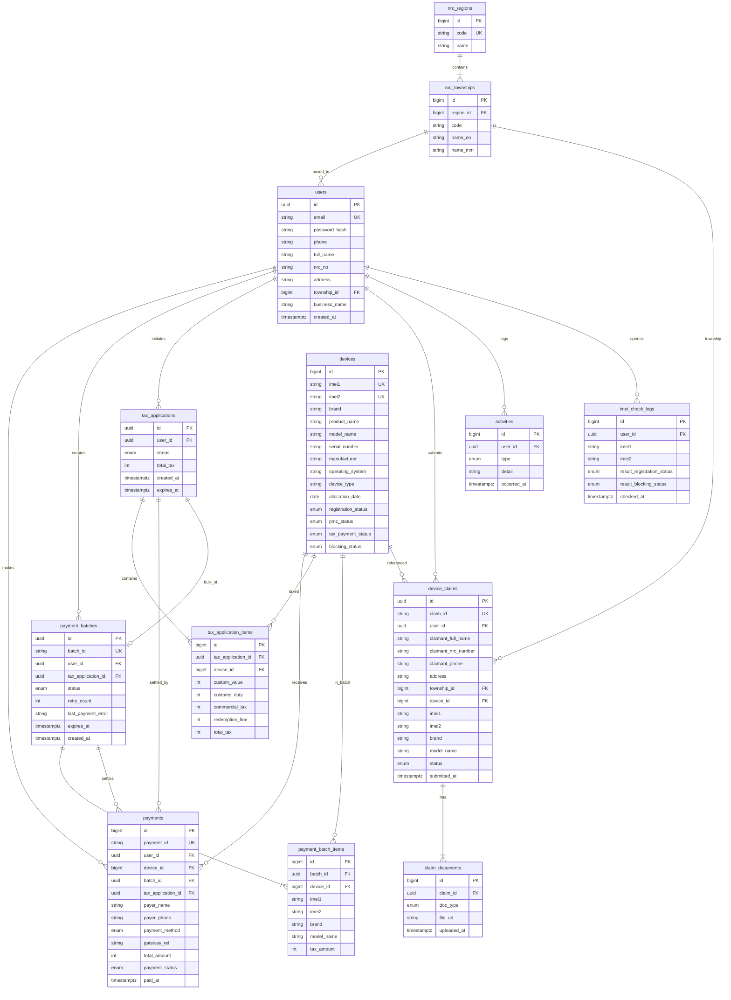

# CEIR Backend ER Diagram (Real API)

This is the **real** schema, reconstructed from the production UI design
(`pencil-new.pen`) and reconciled with the current demo Flutter models. The demo
APK fakes most of this locally; this diagram is what the backend must expose.

Actor: a logged-in **agent** (provisioned by admin; checks IMEI, bulk-pays tax, submits claims).
One actor table (`users`) covers all app users.

> The previous version of this file was drawn from the demo code only and was
> "agent-only". See **"Corrections vs the old diagram"** at the bottom for what
> changed and why.

## ER diagram



> **Public API vs ER:** Login/profile `user` returns `id`, `email`, `phone`, `fullName`, `nrcNo`, `address` only. Columns such as `township_id` and `business_name` stay server-internal and are not part of the public contract.

## Enums (from the design)

| Enum                          | Values (seen in UI)                                   |
| ----------------------------- | ----------------------------------------------------- |
| `devices.registration_status` | `registered`, `partial`, `not_registered`             |
| `devices.pmc_status`          | `correct`, `incorrect`                                |
| `devices.tax_payment_status`  | `paid`, `unpaid`, `pending`                           |
| `devices.blocking_status`     | `allowed`, `blocked`                                  |
| `payments.payment_method`     | `mpu`, `kbzpay`, `wavepay` (design shows **MPU**)     |
| `payments.payment_status`     | `pending`, `success`, `failed`                        |
| `payment_batches.status`      | `draft`, `ready`, `payment_pending`, `paid`, `failed` |
| `tax_applications.status`     | `draft`, `calculated`, `paid`, `expired`              |
| `device_claims.status`        | `submitted`, `under_review`, `approved`, `rejected`   |
| `claim_documents.doc_type`    | `device_photo`                                         |
| `activities.type`             | `tax_paid`, `imei_checked`, `device_claimed`          |

## API endpoints (user JWT required unless noted)

Base URL: `/openapi/v1`. All paths below are relative to it.

| Method | Path                         | Purpose                                                 |
| ------ | ---------------------------- | ------------------------------------------------------- |
| POST   | `/login`                     | Email + password + deviceId → JWT (public) |
| GET    | `/profile`                   | Logged-in user profile                                  |
| POST   | `/imei/check`                | IMEI status (1–2 IMEIs)                                 |
| POST   | `/imei/bulk-check`           | Bulk IMEI status                                        |
| POST   | `/tax/applications`          | Create tax application (1–10 devices)                   |
| GET    | `/tax/applications/{id}`     | Tax breakdown per device + total                        |
| POST   | `/payments/batches`          | Create bulk batch                                       |
| POST   | `/payments/batches/{id}/pay` | Pay batch                                               |
| GET    | `/payments`                  | Payment history                                         |
| GET    | `/payments/{id}`             | Payment detail / receipt                                |
| POST   | `/claims`                    | Submit claim (IMEI pair + optional reason + device photo evidence) |
| GET    | `/claims`                    | Claim list + statuses                                   |
| GET    | `/activities`                | Recent activities                                       |
| GET    | `/nrc/townships`             | NRC regions + townships                                 |

## Endpoint အသုံးပြုပုံ (မြန်မာ)

Endpoint တစ်ခုချင်းစီက mobile app ထဲမှာ ဘယ်နေရာအတွက် သုံးတယ်ဆိုတာ —

| Path                              | ဘာအတွက်သုံးလဲ                                                                                                                                                          |
| --------------------------------- | ---------------------------------------------------------------------------------------------------------------------------------------------------------------------- |
| `POST /login`                     | Login screen — email + password + deviceId ဖြင့် အကောင့်ဝင်ခြင်း။ အောင်မြင်ရင် access token ပြန်ရပြီး နောက် request တွေမှာ သုံးရ။                                            |
| `GET /profile`                    | ဝင်ထားတဲ့ user ရဲ့ အချက်အလက် (name, userId, email, phone, NRC, address) ကို ဆွဲယူခြင်း — Profile/Home မှာ ပြရန်။                                                            |
| `POST /imei/check`                | Check IMEI screen — IMEI 1 (နှင့် optional IMEI 2) ရိုက်ထည့်ပြီး device ရဲ့ registration/PMC/tax/blocking status ကို စစ်ခြင်း။                                         |
| `POST /imei/bulk-check`           | IMEI အများကြီးကို တစ်ခါတည်း status စစ်ခြင်း (bulk flow မှာ device စာရင်း စစ်ဆေးရန်)။                                                                                   |
| `POST /tax/applications`          | Tax Summary — device (၁–၁၀) အတွက် အခွန်တွက်ချက်ခြင်း (Customs Duty / Commercial Tax / Redemption Fine / စုစုပေါင်း)။ server က တွက်ချက်မှု record တစ်ခု (`id`) ပြန်ပေး။ |
| `GET /tax/applications/{id}`      | တွက်ချက်မှု `id` တစ်ခုရဲ့ အခွန် breakdown ကို ပြန်ဆွဲကြည့်ခြင်း (device တစ်ခုချင်းစီ + စုစုပေါင်း)။                                                                    |
| `POST /payments/batches`          | Bulk pay — device IMEI စာရင်းနဲ့ payment batch တစ်ခု ဖန်တီးခြင်း (`items` only; payer profile က server-side JWT user context ကနေ enrich)။                                      |
| `POST /payments/batches/{id}/pay` | ဖန်တီးထားတဲ့ batch ကို တကယ်ငွေချေခြင်း (MPU စသဖြင့်)။ အောင်မြင်ရင် payment ID + receipt ရ။                                                                             |
| `GET /payments`                   | Payment History screen — ငွေချေမှု မှတ်တမ်းစာရင်း (paginated)။                                                                                                         |
| `GET /payments/{id}`              | Payment History ထဲက item တစ်ခုကို နှိပ်ရင် ပြမယ့် ငွေဖြတ်ပိုင်း (receipt) အသေးစိတ်။                                                                                    |
| `POST /claims`                    | Device Claim — `imei1`, optional `imei2`, optional `reason`, `devicePhoto` multipart ဖြင့် claim တင်ခြင်း (`fullName`, `phone`, `nrcNo`, `address` က server-side profile enrich)။                        |
| `GET /claims`                     | တင်ထားတဲ့ claim တွေရဲ့ စာရင်း + လက်ရှိ အခြေအနေ (submitted/under_review/approved/rejected)။                                                                             |
| `GET /activities`                 | Home ရဲ့ "Recent Activities" — နောက်ဆုံးလုပ်ဆောင်ချက်များ (အခွန်ဆောင်ခဲ့/IMEI စစ်ခဲ့/claim တင်ခဲ့)။                                                                    |
| `GET /nrc/townships`              | NRC တိုင်း/မြို့နယ် reference data (public)။ Current UI forms မှာ dropdown မသုံးသေးပါ — server-side lookup/reference အတွက် ထားထားသည်။                                                                         |

## UI-first operation matrix (strict reconciliation)

This matrix is the canonical mapping for this round. UI flow in `ceir_agent.pen`
is the source of truth.

| UI flow group | Primary frames (Pencil) | Required backend operations | Contract notes |
| --- | --- | --- | --- |
| Login | `Log In`, `Log In_Error`, `Log In_Loading` | `POST /login`, `GET /profile` | Login request must carry `email`, `password`, `deviceId` (+ optional device metadata). No refresh endpoint in this contract. |
| Check IMEI | `Check IMEI No`, `Check IMEI No From Barcode scan`, `Check IMEI No_ Status Info Detail` | `POST /imei/check`, `POST /imei/bulk-check` | API returns registration/pmc/tax/blocking status for 1–2 IMEIs. |
| Pay Tax | `Pay Tax_Check IMEI`, `Pay Tax_Device IMEI Status`, `Pay Tax_Device Information`, `Pay Tax_Tax Summary`, `Pay Tax_Tay Payment Successfully` | `POST /imei/check`, `POST /tax/applications`, `POST /payments/batches`, `POST /payments/batches/{id}/pay`, `GET /payments`, `GET /payments/{id}` | 4-step wizard: IMEI check → device status → device info → summary → pay → success. |
| Claim | Claim IMEI entry/confirm/reason frames + `Check IMEI No_Take a photo` | `POST /imei/check`, `POST /claims` | 3-step wizard: enter/scan IMEIs → confirm IMEI1 paid → reason + device photo submit. |
| Payment History | `Payment History List`, `Payment History List_View Detail`, `Filter by My Claim` | `GET /payments`, `GET /payments/{id}`, `GET /claims` (for my-claim filter if enabled) | List is paginated; detail is full receipt payload. |
| Profile | `Profile` | `GET /profile` | Same `PublicUser` fields as login `user`: id, email, phone, fullName, nrcNo, address. |

## API contracts (request / response)

Conventions:

- Base URL `/openapi/v1`. JSON `Content-Type: application/json` unless noted.
- Auth: `Authorization: Bearer <accessToken>` on every endpoint except `/login`,
  `/nrc/townships`.
- Money fields are integer **MMK** (no decimals). Timestamps are ISO-8601 UTC.
- Errors use one envelope:

```json
{
  "success": false,
  "error": {
    "code": "INVALID_CREDENTIALS",
    "message": "Email or password is incorrect."
  }
}
```

Common error codes: `VALIDATION_ERROR` (400), `UNAUTHORIZED` (401),
`FORBIDDEN` (403), `NOT_FOUND` (404), `IMEI_NOT_FOUND` (404),
`PAYMENT_FAILED` (402), `SERVER_ERROR` (500).

### POST `/login`

Request:

```json
{
  "email": "kyawkyaw@gmail.com",
  "password": "secret123",
  "deviceId": "android-a1b2c3d4",
  "deviceName": "Galaxy A16",
  "platform": "android",
  "appVersion": "1.0.0+1"
}
```

Response `200`:

```json
{
  "accessToken": "eyJhbGciOi...",
  "tokenType": "Bearer",
  "expiresIn": 604800,
  "deviceBinding": {
    "deviceId": "android-a1b2c3d4",
    "boundAt": "2026-07-02T13:26:00Z"
  },
  "user": {
    "id": "b1f2...",
    "email": "kyawkyaw@gmail.com",
    "phone": "09791243682",
    "fullName": "Mr. Kyaw Kyaw",
    "nrcNo": "10/MADAMA(N)123456",
    "address": "No 27(G), Mayangone, Yangon"
  }
}
```

### GET `/profile`

Response `200`: the same `user` object as in `/login`.

### POST `/imei/check`

Request: `{ "imei1": "359876543210108", "imei2": "359876543210109" }` (`imei2` optional)

Response `200`:

```json
{
  "deviceId": 1024,
  "brand": "Samsung",
  "productName": "Galaxy A16",
  "modelName": "SM-A165F/DS",
  "serialNumber": "RF303KEK934E",
  "imei1": "359876543210108",
  "imei2": "359876543210109",
  "registrationStatus": "registered",
  "pmcStatus": "correct",
  "taxPaymentStatus": "unpaid",
  "blockingStatus": "allowed"
}
```

### POST `/imei/bulk-check`

Request: `{ "imeis": [ { "imei1": "35...108", "imei2": null }, { "imei1": "35...200" } ] }`
Response `200`: `{ "results": [ { ...same shape as /imei/check... }, { "imei1": "35...200", "found": false } ] }`

### POST `/tax/applications`

Creates the tax application shown on the Tax Summary screen (1–10 devices).

Request:

```json
{ "devices": [{ "imei1": "359876543210108", "imei2": "359876543210109" }] }
```

Response `201`:

```json
{
  "id": "3f9a...",
  "status": "calculated",
  "totalTax": 925782,
  "expiresAt": "2026-07-09T13:26:00Z",
  "items": [
    {
      "deviceId": 1024,
      "brand": "Samsung",
      "productName": "Galaxy A16",
      "modelName": "SM-A165F/DS",
      "imei1": "359876543210108",
      "imei2": "359876543210109",
      "customValue": 90300,
      "customsDuty": 125782,
      "commercialTax": 125782,
      "redemptionFine": 125782,
      "totalTax": 377346
    }
  ]
}
```

### GET `/tax/applications/{id}`

Response `200`: same shape as the `POST /tax/applications` response.

### POST `/payments/batches`

Request:

```json
{
  "items": [{ "imei1": "359876543210108", "imei2": "359876543210109" }]
}
```

Response `201`:

```json
{
  "batchId": "BATCH-2026-0007",
  "status": "ready",
  "totalTax": 2777346,
  "expiresAt": "2026-07-09T13:26:00Z",
  "items": [
    {
      "deviceId": 1024,
      "brand": "Samsung",
      "modelName": "SM-A165F/DS",
      "imei1": "359876543210108",
      "imei2": "359876543210109",
      "taxAmount": 925782
    }
  ]
}
```

### POST `/payments/batches/{id}/pay`

Request: `{ "paymentMethod": "mpu" }`
Response `200`:

```json
{
  "batchId": "BATCH-2026-0007",
  "status": "paid",
  "paymentId": "2026070213262151-1",
  "paymentMethod": "mpu",
  "gatewayRef": "MPU-8f2a...",
  "totalAmount": 2777346,
  "paidCount": 3,
  "paidAt": "2026-07-02T13:26:00Z"
}
```

On failure `402`: `{ "success": false, "error": { "code": "PAYMENT_FAILED", "message": "...", "retryCount": 1 } }`

### GET `/payments`

Query: `?page=1&pageSize=20`
Response `200`:

```json
{
  "page": 1,
  "pageSize": 20,
  "total": 42,
  "items": [
    {
      "paymentId": "2026070213262151-1",
      "totalAmount": 925782,
      "paymentMethod": "mpu",
      "status": "success",
      "paidAt": "2026-07-02T13:26:00Z",
      "brand": "Samsung",
      "modelName": "SM-A165F/DS",
      "imei1": "359876543210108"
    }
  ]
}
```

### GET `/payments/{id}`

Response `200` (full receipt):

```json
{
  "paymentId": "2026070213262151-1",
  "batchId": "BATCH-2026-0007",
  "status": "success",
  "paymentMethod": "mpu",
  "gatewayRef": "MPU-8f2a...",
  "totalAmount": 925782,
  "paidAt": "2026-07-02T13:26:00Z",
  "device": {
    "brand": "Samsung",
    "productName": "Galaxy A16",
    "modelName": "SM-A165F/DS",
    "serialNumber": "RF303KEK934E",
    "imei1": "359876543210108",
    "imei2": "359876543210109"
  }
}
```

### POST `/claims` (multipart/form-data)

UI-first fields: `imei1`, `imei2` (optional), `reason` (optional short note),
`devicePhoto` (verification capture).

Server enrichment fields (not sent from current UI) are resolved from authenticated
profile (`fullName`, `phone`, `nrcNo`, `address`).

Response `201`:

```json
{
  "claimId": "CLAIM-2026-0031",
  "status": "submitted",
  "imei1": "359876543210108",
  "imei2": null,
  "reason": "IMEI2 lost after factory reset",
  "submittedAt": "2026-07-02T09:12:00Z",
  "documents": [
    { "docType": "device_photo", "fileUrl": "https://cdn/.../device.jpg" }
  ]
}
```

### GET `/claims`

Response `200`:

```json
{
  "items": [
    {
      "claimId": "CLAIM-2026-0031",
      "title": "Infinix Note 40",
      "status": "under_review",
      "submittedAt": "2026-07-02T09:12:00Z"
    }
  ]
}
```

### GET `/activities`

Query: `?limit=10`
Response `200`:

```json
{
  "items": [
    {
      "id": 91,
      "type": "tax_paid",
      "detail": "1 Device(s) Paid Tax Successfully",
      "occurredAt": "2026-07-07T09:17:00Z"
    },
    {
      "id": 90,
      "type": "device_claimed",
      "detail": "Device Claimed",
      "occurredAt": "2026-07-02T09:12:00Z"
    }
  ]
}
```

### GET `/nrc/townships`

Public reference endpoint (no auth). Returns NRC region/township lookup data. Current UI forms do not expose a township picker; kept for server-side enrichment and future use.

Response `200`:

```json
{
  "regions": [
    {
      "id": 1,
      "code": "1",
      "name": "Kachin",
      "townships": [
        {
          "id": 145,
          "code": "KAMANA",
          "nameEn": "Kamayut",
          "nameMm": "ကမာရွတ်"
        }
      ]
    }
  ]
}
```

## Flutter model mapping

| Dart model (demo)      | Table / API                                             |
| ---------------------- | ------------------------------------------------------- |
| `AgentModel`           | `users`                                                 |
| `ImeiStatusModel`      | `devices` (+ `product_name`, `serial_number` are new)   |
| `DeviceDetailModel`    | `devices` (manufacturer/os/device_type/allocation_date) |
| `TaxCalculationModel`  | `tax_applications` + `tax_application_items`            |
| `PaymentHistoryModel`  | `payments` (joined with `devices`)                      |
| `PaymentBatchModel`    | `payment_batches`                                       |
| `BulkPaymentItemModel` | `payment_batch_items`                                   |
| `DeviceClaimModel`     | `device_claims` (+ `address`, `claim_documents`)        |
| `ClaimStatusModel`     | `device_claims` (subset)                                |
| `ActivityModel`        | `activities`                                            |
| `NrcTownship`          | `nrc_townships`                                         |

## Mismatch ledger (UI-first)

| Area | Previous contract | Updated contract | Why changed |
| --- | --- | --- | --- |
| Auth session | `POST /login` returned access+refresh; `/auth/refresh` rotated tokens | `POST /login` is the only auth session endpoint in this diagram; request includes `deviceId` context and response returns access-token session envelope | UI flow has only login entry and no visible refresh UX; user requested refresh-token removal. |
| Auth schema | `refresh_tokens` table in ER | removed from ER in this doc revision | Endpoint removal made table orphaned for this UI-first scope. |
| Login payload | `email`, `password` only | `email`, `password`, `deviceId` (+ optional device metadata fields) | App/backend handshake already relies on device binding semantics. |
| Claim payload | Required NRC front/back + device photo multipart | UI-minimal claim payload: IMEI pair + optional reason + device photo; user profile supplies fullName/phone/nrcNo/address | Current claim screens only collect reason and verified photo, not NRC image pair. |
| Profile payload shape | Included non-UI fields (`townshipId`, `businessName`) and missed profile NRC | UI-visible profile fields: `id`, `email`, `phone`, `fullName`, `nrcNo`, `address` | Profile screen/design prioritizes contact identity fields, including NRC row, and does not present township/business fields. |
| Claim document types | `nrc_front`, `nrc_back`, `device_photo` | `device_photo` | Keep contract aligned to fields actually produced by current claim flow. |
| Protected endpoint list | `/login`, `/auth/refresh`, `/nrc/townships` public | `/login`, `/nrc/townships` public | Refresh endpoint removed. |
| Dealer verification | `POST /dealer/verify` + TIN/BRN in pay-tax flow | removed; no dealer verify step in UI | Pay Tax wizard starts at Check IMEI; IRD verification out of scope. |
| Payment batch payload | `tin`, `businessRegistrationNo` required in request | `items` only (IMEI pairs); payer context from JWT/profile | UI does not collect TIN/BRN; server enriches from logged-in user. |
| User profile fields | `tin`, `businessRegistrationNo`, `dealerVerified` exposed | removed from public contract | Not shown or required by current UI flows. |

## Removed / deprecated in this revision

- `POST /auth/refresh`
- `POST /dealer/verify`
- ER entity `refresh_tokens`
- Login/refresh response field dependency on `refreshToken` in backend contract
- Claim multipart requirement for `nrcFront` / `nrcBack` in this UI-first contract
- User/profile fields: `tin`, `businessRegistrationNo`, `dealerVerified`
- Payment batch request fields: `tin`, `businessRegistrationNo`
- ER columns: `users.dealer_verified`, `payment_batches.dealer_business_name`, `payment_batches.dealer_verified`
